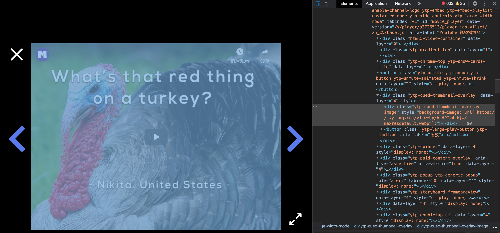

## 下载mysteryscience视频的方法

1. 打开网页，在视频处点鼠标右键，选择检查元素（Inspect）

2. 右侧出现调试窗口后，从选中的div标签向上找，找到iframe标签，这里有两个iframe，选src=//fast.wistia.net开头的（可以用`cmd+F`来查找）
3. 右键点击src后面的链接，open in new tab
4. 在新的网页里也打开调试窗口，可以按`cmd+option+i`
5. 选择Network tab，刷新网页再查找`.m3u8`扩展名的文件，复制出以`.m3u8`结尾的链接备用（通常是第一个，下面用URL表示）
6. 将ffmpeg放到个人文件夹（在Finder的边栏里显示的是“🏠用户名”，如果没有可以在Finder的偏好设置里选择将🏠打勾）
7. 在console（启动台->其他->终端）里执行下面的命令，替换URL和filename即可，且filename不识别中文
`./ffmpeg  -i "URL" -c copy -bsf:a aac_adtstoasc "filename.mp4"` 如果提示Permission denied，请执行 `chmod +x ffmpeg`后再试
